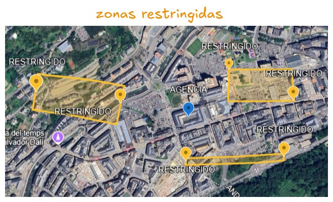
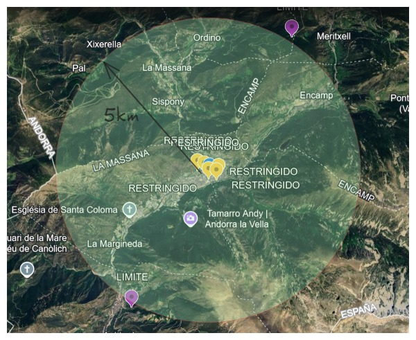

# 🚗 Car Agency 

### 📖 Overview
This document outlines the database structure for a car agency. It provides details on the various tables used to manage the agency's operations, including employees, interested customers, brands, models, notifications, vehicle positions, tests, and vehicles.

### 📋 Tables Description

- **👨‍💼 Empleados**: Contains information about the employees working at the agency.
- **🧑‍🤝‍🧑 Interesados**: Stores details about interested customers, including their documents and licenses.
- **🏷️ Marcas**: Holds the different car brands available at the agency.
- **🚘 Modelos**: Contains car models associated with each brand.
- **📬 Notificaciones**: Manages notifications related to employees and other relevant information.
- **📍 Posiciones**: Tracks the positions of vehicles, including their latitude and longitude.
- **📝 Pruebas**: Records tests conducted on vehicles, including details about the employees and interested customers involved.
- **🚗 Vehiculos**: Contains information about the vehicles available at the agency.

## 💾 Database Structure

## 🌍 Restricted Zones and Allowed Radius

This section provides visuals illustrating the restricted zones and the radius within which vehicles are permitted to operate.

###  🚫 Restricted Zones

*This image shows the general layout of the restricted zones within the agency's operational area, highlighting where vehicles are not allowed to operate.*

### 🟢 Allowed Radius

*This graphic depicts the radius within which vehicles are authorized to operate in relation to the agency. It outlines the permissible area surrounding the agency.*

For more detailed geographic information, visit [Google Earth](https://earth.google.com/earth/d/1MhR_sH8E4Rkww0rtBbOarKmjkQdc1RNU?usp=sharing). 🔗

