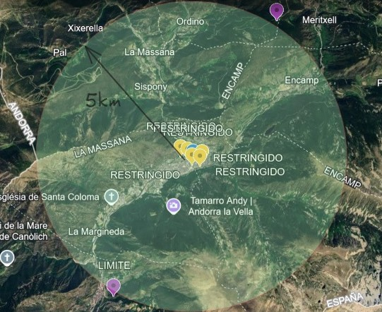

# 🚗 Car Agency 

### 📖 Overview
Este proyecto corresponde al desarrollo del backend de una agencia de venta de vehículos usados, implementado como parte de un trabajo práctico integrador. El sistema permite gestionar pruebas de manejo, rastrear vehículos en tiempo real y garantizar que operen dentro de zonas y radios permitidos. Adicionalmente, implementa notificaciones y restricciones para maximizar la seguridad y control operativo.

## 🚀 Funcionalidades Clave

### 1️⃣ Gestión de Pruebas de Manejo
- Registro de pruebas asociando cliente, vehículo y empleado.
- Validación de:
  - Licencias de clientes (no vencidas).
  - Estado del cliente (no restringido para realizar pruebas).
  - Disponibilidad del vehículo para evitar pruebas simultáneas.
- Finalización de pruebas con comentarios opcionales por parte del empleado.

### 2️⃣ Rastreo y Seguridad de Vehículos
- Recepción de coordenadas en tiempo real de los vehículos.
- Validación de posición para:
  - Detectar si un vehículo excede el radio permitido.
  - Evitar ingreso a zonas restringidas definidas.
- Generación de notificaciones automáticas:
  - Al empleado responsable, para que retorne el vehículo.
  - Registro del cliente en una lista de usuarios restringidos.

### 3️⃣ Notificaciones
- Envío de notificaciones promocionales a clientes (vía base de datos o medios externos como SMS o correo, según configuración).

### 4️⃣ Reportes
Generación de reportes detallados sobre:
- **Incidentes**: Casos donde se excedieron los límites establecidos.
- **Pruebas por Empleado**: Resumen de incidentes y pruebas realizadas.
- **Distancias Recorridas**: Kilómetros cubiertos por cada vehículo en periodos específicos.
- **Historial de Pruebas**: Detalle completo de pruebas realizadas para un vehículo específico.

### 5️⃣ Consumo de Servicios Externos
- Obtención de:
  - Coordenadas de la agencia.
  - Radio permitido para pruebas.
  - Zonas restringidas.
- Estos datos son consumidos a través de un servicio proporcionado por la cátedra.

### 6️⃣ Seguridad
- Implementación de mecanismos de autenticación y autorización:
  - Solo empleados pueden crear pruebas y enviar notificaciones.
  - Solo usuarios asociados a vehículos pueden reportar posiciones.
  - Solo administradores pueden generar reportes.

## 🛠️ Arquitectura del Proyecto
- Diseño basado en **microservicios**, asegurando modularidad y escalabilidad.
- Uso de un **API Gateway** como punto de entrada único.
- Cumplimiento de lineamientos propuestos para la interacción entre servicios.

## 💾 Estructura de la Base de Datos
La base de datos incluye tablas para:
- **👨‍💼 Empleados**: Información de los empleados de la agencia.
- **🧑‍🤝‍🧑 Interesados**: Datos de clientes interesados, incluyendo documentos y licencias.
- **🏷️ Marcas** y **🚘 Modelos**: Catálogo de marcas y modelos de vehículos.
- **📬 Notificaciones**: Registro de notificaciones enviadas.
- **📍 Posiciones**: Ubicaciones de los vehículos con coordenadas (latitud y longitud).
- **📝 Pruebas**: Información detallada sobre pruebas de manejo.
- **🚗 Vehículos**: Inventario de vehículos disponibles.

### Diagrama de Base de Datos

## 🌍 Zonas Restringidas y Radio Permitido

### 🚫 Zonas Restringidas
  
Zonas consideradas peligrosas donde los vehículos no pueden operar.

### 🟢 Radio Permitido
  
Área geográfica en la que los vehículos pueden operar sin restricciones.

Para más detalles, visita el mapa interactivo en [Google Earth](https://earth.google.com/earth/d/1MhR_sH8E4Rkww0rtBbOarKmjkQdc1RNU?usp=sharing). 🔗

## 🔗 Requerimientos Técnicos
- Node.js / Express para el backend.
- Uso de servicios externos para datos geográficos.
- Microservicios y API Gateway como elementos fundamentales.
- Seguridad con autenticación y autorización por roles.

---
